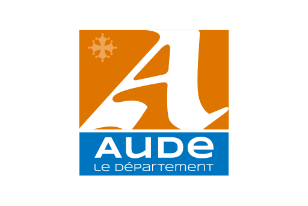

# Débi'Clic

**Débi’Clic** est une bibliothèque JavaScript légère et configurable permettant de visualiser les hauteurs d’eau et les débits des cours d’eau en France. Elle s’appuie sur l’API hydrométrie [Hub’Eau](https://hubeau.eaufrance.fr/) pour offrir une interface interactive intégrable dans toute page web grâce à une simple balise `<script>`.

Développé par [SMMAR](https://www.smmar.fr/), cet outil est conçu pour être simple à déployer, performant, responsive, et personnalisable.

---

## 🎯 Objectif

Permettre aux collectivités, acteurs publics ou tout autre site tiers d’intégrer un composant cartographique affichant les données de suivi hydrométrique (hauteurs, débits) en lien avec les mesures de restriction, les seuils de vigilance et l’état des ressources en eau.

---

## 🚀 Fonctionnalités

- 🌍 **Carte interactive** des stations de mesure (Leaflet)
- 📋 **Liste synchronisée** des stations avec survols et clics
- 📈 **Graphiques dynamiques** des 30 derniers jours (uPlot)
- 🧩 **Configuration simple** via `debiclic.init()`
- 🎨 **Personnalisation de l’affichage** : couleurs, unités, noms, tri
- 🖼️ **Support multi-instances** sur une même page
- 📱 **Interface responsive** adaptée aux mobiles et tablettes
- 📤 **Export des graphiques** en PNG
- 🛠️ **Licence open-source AGPL 3.0**

---

## 🔧 Intégration

### 1. Ajouter un conteneur dans la page

```html
<div id="debiclic-widget"></div>
```

### 2. Initialiser le widget avec une configuration JavaScript

```html
<script>
  debiclic.init({
    container: "#debiclic-widget",
    codeStations: ["F001000101", "F002000101"],
    stationsLabels: {
      "F001000101": "Ma station 1",
      "F002000101": "Ma station 2"
    },
    colors: {
      station: "#007BFF",
      graph: "#007BFF"
    },
    grandeurHydro: "QmnJ",
    days: 15,
    sort: "desc",
    showMap: true,
    thresholdType: 'low-water', // 'none', 'low-water', ou 'flood'
    thresholds: {
      "F001000101": [
        { label: 'Vigilance', value: 50, color: 'yellow' },
        { label: 'Alerte', value: 25, color: 'orange' },
        { label: 'Crise', value: 10, color: 'red' }
      ]
    }
  });
</script>
```

### 3. Ajouter le script debiclic.min.js

```html
<script src="https://unpkg.com/debiclic@latest/dist/embed/debiclic.min.js"></script>
```

Ce script injecte dynamiquement une iframe contenant l'application Débi'Clic, puis lui transmet automatiquement la configuration via `postMessage`.

---

## 📘 Documentation complète

- 📄 [Guide d’intégration pas à pas](./docs/integration.md)
- 🧪 [Exemples de configuration](./examples)
- 🧱 [Structure du code source](./src)
- 📚 [Licence AGPL-3.0](./LICENSE)

### 🔀 Modes de coloration par seuil (`thresholdType`)

Le paramètre global `thresholdType` contrôle la coloration des stations en fonction des seuils définis pour chaque station :

| Mode | Comportement | Exemple visuel |
|------|--------------|----------------|
| `none` | Aucune influence des seuils : toutes les stations utilisent `colors.station`. | Couleur uniforme. |
| `flood` | Couleur = couleur du dernier seuil dépassé (plus grand seuil dont la valeur est ≤ observation). Si l'observation est inférieure au premier seuil, couleur par défaut. | Progression de couleur avec la montée de la valeur. |
| `low-water` | Couleur = couleur du premier seuil au-dessus de la valeur mesurée (plus petit seuil strictement > observation). Si la valeur est au-dessus du plus haut seuil, couleur par défaut. | Met en évidence la proximité d'un seuil bas. |

Pour activer la logique, définissez également des `thresholds` :

```js
thresholds: {
  "F001000101": [
  { label: 'Vigilance', value: 50, color: 'yellow', style: 'dotted', default: true },
  { label: 'Alerte', value: 25, color: 'orange', style: 'dashed', default: true },
  { label: 'Crise', value: 10, color: 'red', style: 'solid', default: true }
  ]
}
```

Dans le graphique :
* Chaque seuil apparaît sous forme de ligne (solid, dotted, dashed).
* La légende affiche `NomSeuil (valeur unité)` ; un clic masque/affiche la ligne (l'élément devient semi-transparent lorsqu'inactif).
* Le champ `default` contrôle l'affichage initial.

---

## 🛠️ Développement

```bash
git clone https://github.com/smmar/debiclic.git
cd debiclic
yarn install

# Démarrer l'application en mode développement
yarn dev

# Lancer un build optimisé (iframe + script)
yarn build

# Prévisualiser le build (http://localhost:4173)
yarn preview

# Vérifier le code avec ESLint
yarn lint

# Corriger automatiquement les erreurs ESLint
yarn lint:fix
```

---
## Ce projet a été financé dans le cadre du PAPI 3 par l'État, le Conseil Départemental de l'Aude et le SMMAR EPTB AUDE
   
